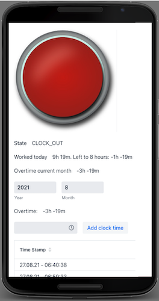

# Time clock stamper UI
is a simple service that lets you stamp in and stamp out. It gives you an overview 
about your overtime per month.

### Prerequisites
- Java 11 JDK
- A JAVA IDE
- A running instance of de.trundicho:time-clock-stamper-ws

## How to start?
Just run the "TimeClockStamperUiApplication.java" out of your IDE.
Configuration parameters can be adjusted in the application.properties

## Built With
* [Maven](https://maven.apache.org/) - Dependency Management
* [Spring-Boot](http://spring.io/projects/spring-boot) - Spring-Boot
* [Vaadin](https://vaadin.com/) - Java server rear UI

## Authors
* **Angelo Romito** - *Initial work* - [Trundicho](https://github.com/Trundicho)

## License
This project is licensed under Apache License Version 2.0 - see the [LICENSE](LICENSE) file for details
